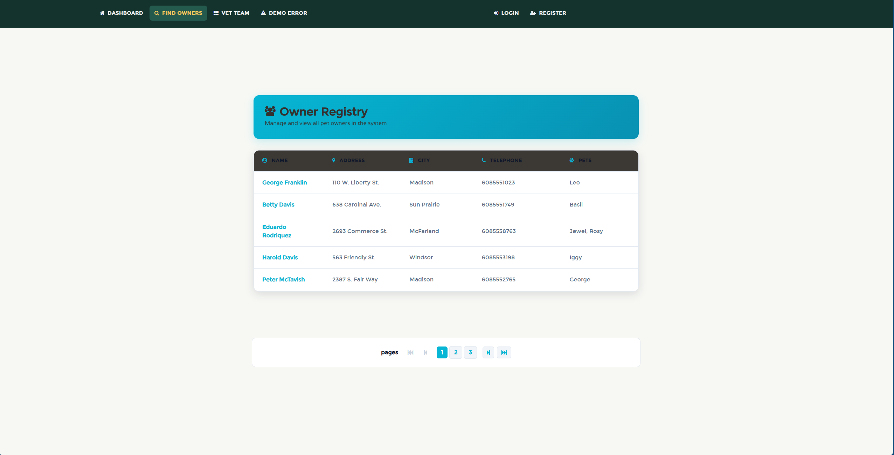

# Paws Pet Clinic

[](https://github.com/varunsidr/Paws-Pet-clinic/actions/workflows/maven-build.yml)
[](https://github.com/varunsidr/Paws-Pet-clinic/actions/workflows/gradle-build.yml)

<p align="center">
	
</p>

Paws Pet Clinic is a Spring Boot application for managing daily veterinary clinic work. It provides a focused operations dashboard for owner records, pet profiles, visits, and the veterinary team.

## Features

- Clinic overview with live counts for owners, pets, veterinarians, and visits
- Owner search, registration, and profile maintenance
- Pet records, pet types, and visit history
- Veterinary directory with specialties
- Registration and sign-in pages for the clinic workflow
- H2 for local development, with MySQL and PostgreSQL profiles available
- Health endpoint at `http://localhost:8080/actuator/health`

## Run Locally

### Prerequisites

- Java 17 or newer
- Git

Clone the repository and start the application with the Maven wrapper:

```bash
git clone https://github.com/varunsidr/Paws-Pet-clinic.git
cd Paws-Pet-clinic
./mvnw spring-boot:run
```

On Windows PowerShell, use:

```powershell
.\mvnw.cmd spring-boot:run
```

Open `http://localhost:8080` in your browser. You can use the Gradle wrapper instead with `./gradlew bootRun`.

## Database Profiles

The default profile starts with an in-memory H2 database and sample clinic data. To use MySQL or PostgreSQL, start the matching service and activate its profile:

```bash
docker compose up mysql
SPRING_PROFILES_ACTIVE=mysql ./mvnw spring-boot:run
```

Replace `mysql` with `postgres` to use PostgreSQL. Database setup notes are available in `src/main/resources/db/mysql` and `src/main/resources/db/postgres`.

## Test And Build

```bash
./mvnw test
./mvnw package
```

To build a container image through Spring Boot:

```bash
./mvnw spring-boot:build-image
docker run -p 8080:8080 docker.io/library/paws-pet-clinic:latest
```

## Technology

- Java 17 and Spring Boot
- Spring Data JPA and Bean Validation
- Thymeleaf templates
- H2, MySQL, and PostgreSQL support
- Maven and Gradle wrappers

## Attribution

This project began from the [Spring Petclinic](https://github.com/spring-projects/spring-petclinic) sample application and has been customized as Paws Pet Clinic.
